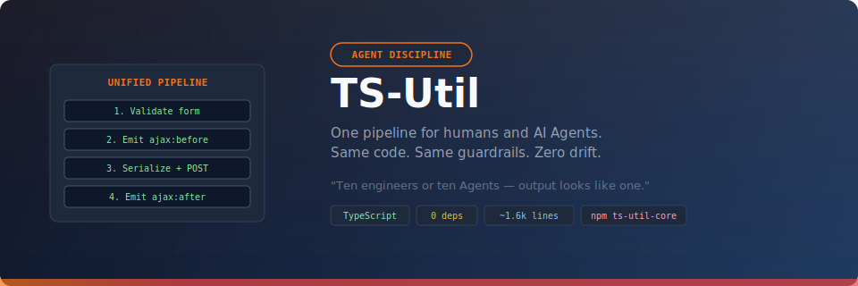

<p align="center">
  
</p>

<p align="center">
  <strong>The form infrastructure toolkit for enterprise web apps.</strong><br/>
  Drop jQuery. Keep the patterns. Ship with confidence.
</p>

<p align="center">
  <a href="#quick-start">Quick Start</a>&ensp;&bull;&ensp;
  <a href="#live-demo">Live Demo</a>&ensp;&bull;&ensp;
  <a href="#modules">Modules</a>&ensp;&bull;&ensp;
  <a href="#api-reference">API Reference</a>&ensp;&bull;&ensp;
  <a href="docs/good-design-pattern-implementation-after.md">Design Patterns</a>
</p>

---

## Why TS-Util?

| Pain point | How this library solves it |
|---|---|
| **"Our forms need validation, masking, AJAX, dialogs — that's 4 libraries."** | One import. Six modules. Zero dependencies. |
| **"Dynamic content loaded via AJAX has no validation."** | `VIEW.load()` auto-initializes constraints and formatters on every fragment. |
| **"Adding a custom input format means touching library internals."** | `Formatter.add({ key, format })` — register from the outside, never fork. |
| **"Runtime surprises: wrong callback shape, misspelled event name."** | Every event, callback, and option is type-checked at compile time. |

### The deeper reason: discipline at scale

Every frontend project eventually hits the same problem: ten engineers (or ten AI Agents) write ten different ways to make an AJAX call. Should you validate the form before sending? Show a loading overlay? How should errors be handled? Everyone has a different answer, and code review can only do so much.

**TS-Util encodes decisions into infrastructure.** When you call `AJAX.request()`, form validation, loading state management, error broadcasting, and data serialization all happen automatically. You can't skip any of them — and neither can your teammates or your AI coding assistants.

**For teams** — engineers learn one API, new members read one example to get started, and every request flows through the same pipeline. No debates, no divergence.

**For AI Agents** — an Agent emits `AJAX.request({ url, form })` instead of expanding the full fetch + validation + error handling logic every time. Context window is AI's most precious resource; saving tokens preserves quality. The abstraction layer also acts as a guardrail — an Agent cannot "forget" to validate a form because the architecture enforces it automatically.

> **Wrapping isn't about writing less code — it's about making ten people, or ten Agents, produce output that looks like it came from one.**

📖 Read the full article in [six languages](docs/why-wrap-ajax-and-view.md) (繁體中文 · English · 日本語 · 한국어 · Español · Deutsch)

---

## Live Demo

> **[Open `demo.html`](demo.html)** — an interactive single-page guide with live output consoles for every module.
>
> ```bash
> npx serve .        # then open http://localhost:3000/demo.html
> ```

The demo lets you click through Events, AJAX, Validation, Formatting, MSG dialogs, VIEW injection, and utility functions — with code snippets alongside real-time results.

---

## Quick Start

### Install

```bash
npm install ts-util-core
```

### Import what you need

```typescript
import { AJAX, VIEW, MSG, Validation, Formatter, Events } from 'ts-util-core';
```

### Or use the global namespace (legacy `<script>` tags)

```html
<script type="module" src="dist/index.js"></script>
<script>
  const { AJAX, MSG } = window['#'];
</script>
```

### A real-world example in 12 lines

```typescript
import { AJAX, MSG, Events } from 'ts-util-core';

// Listen for lifecycle events
Events.on('ajax:before', ({ url }) => showSpinner(url));
Events.on('ajax:after',  ({ url }) => hideSpinner(url));

// Submit a form with auto-validation
await AJAX.request({
  url: '/api/orders',
  form: document.getElementById('order-form')!,
  success: () => MSG.info('Order saved!', { autoclose: 3000 }),
});
```

That single `AJAX.request()` call will:
1. Validate all `constraint="required"` fields in the form
2. Emit `ajax:before` (your spinner appears)
3. Serialize the form to JSON and POST it
4. Emit `ajax:after` (spinner hides)
5. Call your `success` callback

---

## Architecture

```
                        ┌─────────────────┐
                        │  EventEmitter   │  ← Typed central bus
                        │  (Mediator)     │
                        └──┬──┬──┬──┬─────┘
                  ┌────────┘  │  │  └────────┐
                  ▼           ▼  ▼           ▼
             ┌────────┐  ┌──────┐  ┌───────────┐  ┌───────────┐
             │  AJAX  │  │ VIEW │  │ Validation │  │ Formatter │
             │Facade +│  │Observ│  │ Strategy + │  │ Registry  │
             │Template│  │  er  │  │ Decorator  │  │  Pattern  │
             └────────┘  └──────┘  └───────────┘  └───────────┘
                  │           │          │               │
                  └─────┬─────┘     ┌────┘               │
                        ▼           ▼                    ▼
                    ┌───────┐  ┌──────────┐     ┌──────────────┐
                    │  MSG  │  │  Utils   │     │ HTML attrs   │
                    │Dialogs│  │sprintf,  │     │ constraint=  │
                    └───────┘  │formToJSON│     │ format=      │
                               └──────────┘     └──────────────┘
```

All modules communicate through the typed `EventEmitter` — no module imports another directly. This makes every piece independently testable and replaceable.

---

## Modules

### Events — the central bus

```typescript
// Subscribe with full type safety — event names and payloads are checked
Events.on('ajax:before', ({ url }) => console.log(url));     // url: string
Events.on('ajax:error',  ({ url, error }) => log(error));    // error: Error

// Unsubscribe
const off = Events.on('ajax:after', handler);
off(); // done
```

**Available events:**

| Event | Payload | Fired when |
|-------|---------|------------|
| `ajax:before` | `{ url }` | Request starts (unless `noblock`) |
| `ajax:after` | `{ url }` | Request completes |
| `ajax:error` | `{ url, error }` | Request fails |
| `view:beforeLoad` | `{ context }` | New DOM fragment initializes |
| `validation:invalid` | `{ labelNames, elements }` | Required fields missing |
| `validation:textareaTooLong` | `{ labelNames, maxlengths, elements }` | Textarea exceeds limit |

---

### AJAX — fetch with lifecycle

```typescript
// Simple POST
await AJAX.request({
  url: '/api/save',
  data: { name: 'Alice' },
  success: (res) => console.log('Done'),
});

// POST with auto-validation + form serialization
await AJAX.request({
  url: '/api/save',
  form: document.getElementById('myForm')!,
});

// Typed JSON response
const user = await AJAX.requestJSON<User>({
  url: '/api/user/1',
  success: (data) => { /* data is User, not unknown */ },
});
```

---

### Validation — declarative constraints

Declare in HTML, the library does the rest:

```html
<input constraint="required"             labelName="Name" />
<input constraint="required number"      labelName="Amount" />
<input constraint="required upperCase onlyEn" labelName="Code" />
<input constraint="date"                 labelName="Start Date" />
<input constraint="time"                 labelName="Meeting Time" />
```

**Built-in constraints:** `required` `number` `date` `time` `upperCase` `onlyEn`

**Add your own:**

```typescript
Validation.addConstraint({
  name: 'email',
  attach(el) {
    el.addEventListener('change', () => {
      if (el.value && !el.value.includes('@')) el.value = '';
    });
  },
});
// Now use: <input constraint="required email" labelName="Email" />
```

**Customize error handling:**

```typescript
Validation.setRequiredInvalidCallback((labelNames, elements) => {
  // Replace the default alert with your own UI
  showToast(`Missing: ${labelNames.join(', ')}`);
  elements[0]?.focus();
});
```

---

### Formatting — input masks

Declare in HTML:

```html
<input format="idNumber" />   <!-- A123456789 -->
<input format="date" />       <!-- 2026-02-24 (auto-inserts dashes) -->
<input format="time" />       <!-- 14:30 (auto-inserts colon) -->
```

**Register custom formatters:**

```typescript
Formatter.add({
  key: 'phone',
  format: (el) => {
    el.placeholder = '09XX-XXX-XXX';
    el.addEventListener('input', () => {
      let v = el.value.replace(/\D/g, '');
      if (v.length > 4) v = v.slice(0, 4) + '-' + v.slice(4);
      if (v.length > 8) v = v.slice(0, 8) + '-' + v.slice(8);
      el.value = v.slice(0, 12);
    });
  },
});
```

---

### MSG — vanilla DOM dialogs

```typescript
// Auto-closing notification
MSG.info('Saved!', { title: 'Success', autoclose: 3000 });

// Modal (must click OK)
MSG.modal('Session expired.', { title: 'Warning' });

// Confirmation
MSG.confirm('Delete', 'Are you sure?', () => {
  deleteRecord();
});

// Dismiss programmatically
MSG.dismissModal();
```

---

### VIEW — dynamic content with auto-init

```typescript
// Load an HTML fragment — constraints + formatters auto-initialize
await VIEW.load(document.getElementById('container')!, {
  url: '/api/partial-view',
});

// Or inject manually and trigger hooks
container.innerHTML = htmlString;
VIEW.invokeBeforeLoad(container);

// Register your own hook
VIEW.addBeforeLoad((context) => {
  context.querySelectorAll('.tooltip').forEach(initTooltip);
});
```

---

### Utilities

```typescript
import { sprintf, formToJSON, isDateValid } from 'ts-util-core';

sprintf('Hello %s, you are %d years old', 'Alice', 30);
// → "Hello Alice, you are 30 years old"

sprintf('Price: $%.2f', 9.5);
// → "Price: $9.50"

const data = formToJSON(formElement);
// → { username: "alice", role: "viewer" }

isDateValid('2026-02-24');  // → true
isDateValid('not-a-date');  // → false
```

---

## API Reference

### Singletons (pre-wired, ready to use)

| Export | Type | Description |
|--------|------|-------------|
| `AJAX` | `Ajax` | HTTP client with form validation integration |
| `VIEW` | `View` | Dynamic HTML fragment loader |
| `MSG` | `Message` | DOM dialog system |
| `Validation` | `Validator` | Form validation engine |
| `Formatter` | `FormatterRegistry` | Input mask registry |
| `Events` | `EventEmitter<TSUtilEventMap>` | Typed event bus |

### Utility functions

| Export | Signature | Description |
|--------|-----------|-------------|
| `sprintf` | `(fmt: string, ...args) => string` | printf-style string formatting |
| `formToJSON` | `(container: HTMLElement, options?) => FormDataRecord` | Serialize form inputs to JSON |
| `isDateValid` | `(value: string) => boolean` | Validate date strings |
| `parseHTML` | `(html: string) => HTMLElement` | Parse HTML string to DOM |
| `scrollToElement` | `(el: HTMLElement) => void` | Smooth scroll to element |
| `defaults` | `<T>(base: T, ...overrides: Partial<T>[]) => T` | Merge defaults with overrides |

### Classes (for advanced use / testing)

| Export | Description |
|--------|-------------|
| `EventEmitter<T>` | Create isolated event buses for testing |
| `Ajax` | Instantiate with a custom emitter |
| `View` | Instantiate with a custom emitter + ajax |
| `Message` | Standalone dialog system |
| `Validator` | Standalone validator with custom emitter |
| `FormatterRegistry` | Standalone formatter registry |

---

## Project Structure

```
src/
├── index.ts                  # Barrel export + singleton wiring
├── types.ts                  # Shared type definitions
├── core/
│   ├── event-emitter.ts      # Typed EventEmitter (Mediator)
│   ├── ajax.ts               # HTTP client (Facade + Template Method)
│   ├── view.ts               # Fragment loader (Observer)
│   └── message.ts            # Dialog system (Facade)
├── validation/
│   ├── validator.ts           # Validation engine (Strategy)
│   └── constraints.ts         # Built-in constraints (Decorator)
├── formatting/
│   ├── registry.ts            # Formatter registry (Registry Pattern)
│   └── formatters.ts          # Built-in formatters
└── utils/
    ├── sprintf.ts             # printf-style formatting
    └── dom.ts                 # DOM helpers
```

**12 source files &middot; ~1,600 lines &middot; strict TypeScript &middot; ES2022 target &middot; zero dependencies**

---

## Build

```bash
npm run build          # one-shot compile
npm run dev            # watch mode
```

Output goes to `dist/` with `.js`, `.d.ts`, and source maps.

---

## Design Patterns

This library is a teaching-friendly codebase. Every module implements a named GoF pattern:

| Pattern | Module | What it teaches |
|---------|--------|----------------|
| **Mediator** | `EventEmitter` | Decoupled inter-module communication |
| **Facade** | `AJAX`, `MSG` | Hide multi-step complexity behind one call |
| **Template Method** | `requestJSON()` | Reuse a base algorithm, customize one step |
| **Observer** | `VIEW.addBeforeLoad()` | Plugin registration without coupling |
| **Strategy** | `setRequiredInvalidCallback()` | Replace behavior without modifying source |
| **Registry** | `Formatter` | Extensible key-based lookup |
| **Decorator** | `constraint="..."` attributes | Composable behavior via HTML |

Deep-dive documentation:
- **[Before (jQuery)](docs/good-design-pattern-implementation-before.md)** — patterns in the original codebase
- **[After (TypeScript)](docs/good-design-pattern-implementation-after.md)** — how TypeScript makes them safer

---

## License

MIT
